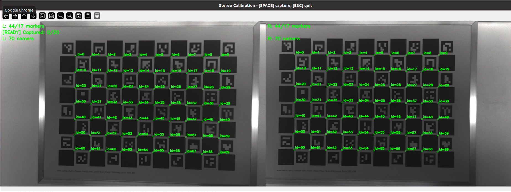
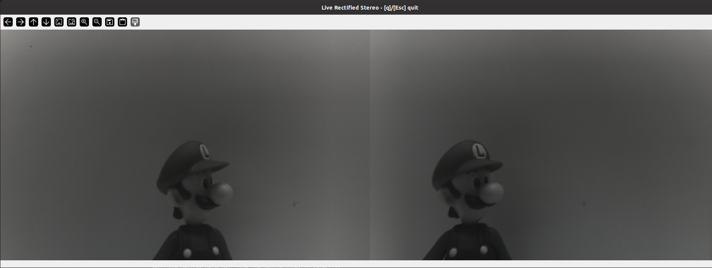

# Python Demo

## Installation dependence

```bash
cd python
python -m pip install -r requirements.txt
```

## Demo

### read_calib_data.py

Scan for connected devices and read the calibration JSON stored on the first device found.

```bash
python read_calib_data.py
```

Expected output:

```
device[0]: vid=0x... pid=0x... node=/dev/video0 bus=1 address=2
version=0
json={...}
```

### write_calib_data.py

Write a calibration JSON file to the selected device found, then read it back to verify.

The demo reads `../calib_example.json` by default. You can replace it with your own calibration file.

```bash
python write_calib_data.py
```

Expected output:

```
selected device: vid=0x... pid=0x... node=/dev/video0 bus=1 address=2
write_json success
read version=0
read json={...}
```

### calibration/calib.py

Stereo calibration tool for Arducam UVC Stereo cameras.

This script is used to capture stereo calibration image pairs, run ChArUco-based stereo calibration, save the calibration result and write the generated calibration data to stereo camera.



```bash
python calibration/calib.py

```
### undistort/rectify.py

Simple rectification demo for Arducam UVC Stereo cameras.

This script reads the calibration data stored in the camera flash, opens the stereo video stream, and displays a real-time rectified preview using the on-device calibration result.




```bash
python undistort/rectify.py
```

### stereo_match

A real-time stereo disparity and object ranging tool for Arducam UVC Stereo cameras.

This demo reads the calibration data stored in the camera flash, opens the stereo video stream, performs rectification and stereo matching, and displays the left view, right view, or disparity map in a GUI.

It also provides interactive controls for disparity parameters, post-filtering, confidence thresholding, and hole filling, making it
convenient to tune and preview stereo matching results in real time.
In addition, it supports YOLO object detection with ultralytics, allowing detected objects to be highlighted live in the preview and their
estimated X / Y / Z coordinates to be computed from the current disparity result.

```bash
python stereo_match/demo.py
```