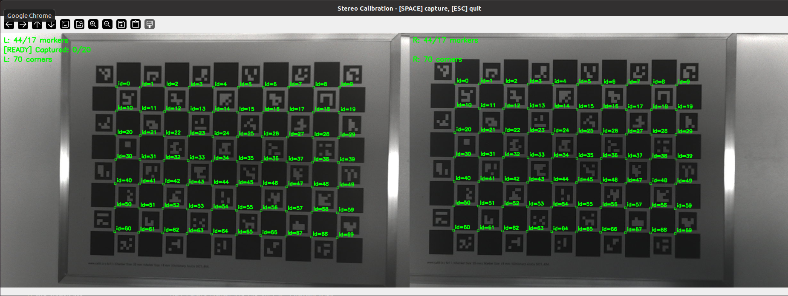
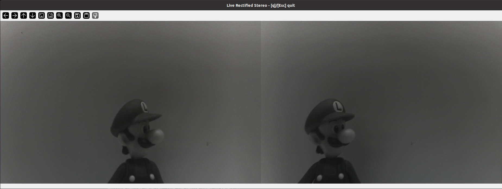

# Python Demo

## Installation dependence

```bash
cd python
python -m pip install -r requirements.txt
```

## Demo

### read_calib_data.py

Scan for connected devices and read the calibration JSON stored on the first device found.

```bash
python read_calib_data.py
```

Expected output:

```
device[0]: vid=0x... pid=0x... node=/dev/video0 bus=1 address=2
version=0
json={...}
```

### write_calib_data.py

Write a calibration JSON file to the selected device found, then read it back to verify.

The demo reads `../calib_example.json` by default. You can replace it with your own calibration file.

```bash
python write_calib_data.py
```

Expected output:

```
selected device: vid=0x... pid=0x... node=/dev/video0 bus=1 address=2
write_json success
read version=0
read json={...}
```

### calibration/stereo_calib.py

Stereo calibration tool for Arducam UVC Stereo cameras.

This script is used to capture stereo calibration image pairs, run ChArUco-based stereo calibration, save the calibration result and write the generated calibration data to stereo camera.



```bash
python calibration/calib.py

```

### calibration/mono_calib.py

Mono calibration tool for one UVC camera.

This script follows the same capture, process, save, and SDK write flow as the stereo calibration tool. It saves captured images under `<dataset>/images`, writes a flat mono calibration JSON with `width`, `height`, `intrinsicMatrix`, `dist_coeff`, and `reprojection_error`, and stores that JSON on the selected device with `write_json`.

```bash
python calibration/mono_calib.py

```

### undistort/rectify.py

Simple rectification demo for Arducam UVC Stereo cameras.

This script reads the calibration data stored in the camera flash, opens the stereo video stream, and displays a real-time rectified preview using the on-device calibration result.




```bash
python undistort/rectify.py
```

### imu/read_imu.py

Scan for connected devices, open the IMU reader on the first device found, and read one raw IMU sample.

```bash
python imu/read_imu.py
```

Expected output:

```
device[0]: vid=0x... pid=0x... node=/dev/video0 bus=1 address=2
selected device: vid=0x... pid=0x... node=/dev/video0 bus=1 address=2
imu data:
  temperature_raw: ...
  accel_raw:       x=... y=... z=...
  gyro_raw:        x=... y=... z=...
```
