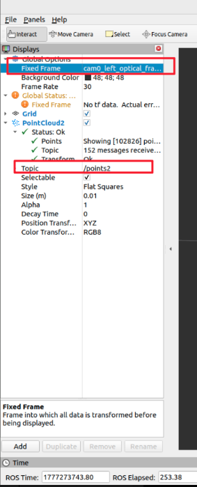

# Arducam UVC Stereo ROS2 Demo

> **Note:** Currently, only ROS2 Humble version is supported.


## 1. Environment preparation

### 1.1. Install dependencies
```bash
sudo apt install python3-numpy python3-opencv python3-colcon-common-extensions 
python -m pip install arducam_uvc_stereo_sdk
```

### 1.2. Set udev rules

Refer to [Set udev rules](../doc/linux_environmental_install.md###set-udev-rules)

## 2. Build the package

```bash
cd ros2
source /opt/ros/$ROS_DISTRO/setup.bash
colcon build --packages-select arducam_uvc_stereo_ros
source install/setup.bash
```

## 3. List camera devices

Before starting, make sure the camera is detected:

```bash
source /opt/ros/$ROS_DISTRO/setup.bash
source install/setup.bash
ros2 run arducam_uvc_stereo_ros list_devices
```

## 4. Start the camera
```bash
ros2 launch arducam_uvc_stereo_ros stereo_camera.launch.py \
  device_index:=0
```


```bash
ros2 run arducam_uvc_stereo_ros stereo_camera_node --ros-args \
  -p device_index:=0
```


## 5. Published topics

After a successful launch, you should see these topics:

- `/cam0/left/image_raw`
- `/cam0/right/image_raw`
- `/cam0/left/camera_info`
- `/cam0/right/camera_info`

## 6. More demos

> More demos rely on 3rd-party ROS packages

### 6.1. Install dependencies

```bash
sudo apt update
sudo apt install -y \
  ros-$ROS_DISTRO-image-pipeline \
  ros-$ROS_DISTRO-stereo-image-proc \
  ros-$ROS_DISTRO-image-view
```

### 6.2. Run the demo

> **Note:**  Please make sure you have started the camera node first: see [Start the camera](#4-start-the-camera)

```bash
ros2 launch stereo_image_proc stereo_image_proc.launch.py \
    left_namespace:=cam0/left \
    right_namespace:=cam0/right
```

Check the topics:
```bash
ros2 topic list
```

Output
```text
topics:
  - /cam0/left/camera_info # calibration info
  - /cam0/left/image_color # color image
  - /cam0/left/image_color/compressed # Compressed color image
  - /cam0/left/image_color/compressedDepth # Depth-compressed color image
  - /cam0/left/image_color/theora # Video-compressed color image
  - /cam0/left/image_mono # grayscale image
  - /cam0/left/image_mono/compressed # Compressed grayscale image
  - /cam0/left/image_mono/compressedDepth # Depth-compressed grayscale image
  - /cam0/left/image_mono/theora # Video-compressed grayscale image
  - /cam0/left/image_raw # Raw camera image
  - /cam0/left/image_rect # Rectified image
  - /cam0/left/image_rect/compressed # Compressed rectified left image
  - /cam0/left/image_rect/compressedDepth # Depth-compressed rectified image
  - /cam0/left/image_rect/theora # Video-compressed rectified left image
  - /cam0/left/image_rect_color # Rectified color image
  - /cam0/right/camera_info 
  - /cam0/right/image_color 
  - /cam0/right/image_color/compressed 
  - /cam0/right/image_color/compressedDepth 
  - /cam0/right/image_color/theora
  - /cam0/right/image_mono
  - /cam0/right/image_mono/compressed
  - /cam0/right/image_mono/compressedDepth
  - /cam0/right/image_mono/theora
  - /cam0/right/image_raw
  - /cam0/right/image_rect
  - /cam0/right/image_rect/compressed
  - /cam0/right/image_rect/compressedDepth
  - /cam0/right/image_rect/theora
  - /cam0/right/image_rect_colo
  - /disparity # Stereo disparity image
  - /parameter_events # Parameter change events
  - /points2 # 3D point cloud
  - /rosout # ROS log messages
```

### 6.3 View the unrectified images

Left Camera:
```bash
ros2 run image_view image_view --ros-args \
  -r /image:=/cam0/left/image_rect 
```

Right Camera:
```bash
ros2 run image_view image_view --ros-args \
  -r /image:=/cam0/right/image_rect 
```

### 6.4 View the disparity image

```bash
ros2 run image_view disparity_view --ros-args \
  -r image:=/disparity
```

### 6.5 View the point cloud

1. Install dependencies
```bash
sudo apt update
sudo apt install -y \
  ros-$ROS_DISTRO-point-cloud-viewer
```

2. Use rviz2 to view the point cloud

```bash
source /opt/ros/$ROS_DISTRO/setup.bash
rviz2
```

In RViz2, click Add, then select PointCloud2.


Set the subscribed topic to /points2, and change Fixed Frame to the camera coordinate frame: cam0_left_optical_frame.



